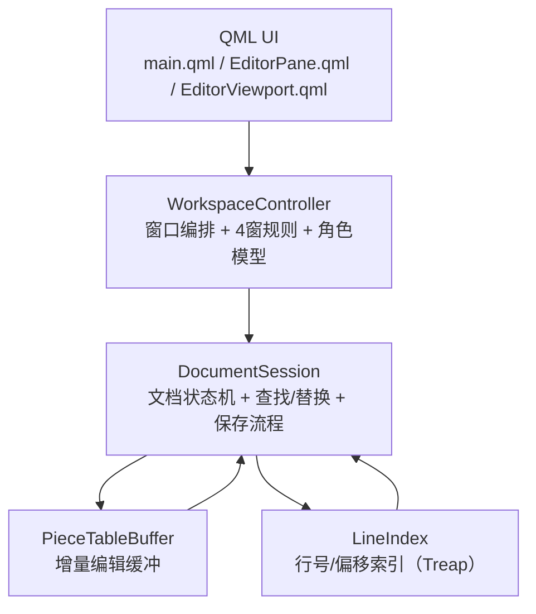

# NCEditor 维护教学主线（实战维护优先）

## 1. 教学目标与达成标准

- 目标：你能独立维护大文件编辑器的核心稳定性问题（打开/编辑/保存/查找替换/窗口生命周期）。
- 达成标准：
  - 不全局翻源码也能判断问题归属层（UI/编排/文档/缓冲/索引）。
  - 能找到正确改动入口并给出最小修复方案。
  - 能完成回归并产出可复现发布结论。

## 2. 阶段一：建立维护心智模型（1次）

### 2.1 五层结构一页图

### 2.2 各层职责（维护视角）

- `QML UI`：负责交互触发与展示，不直接持有大文本。
- `WorkspaceController`：多窗口行为规则与焦点管理，负责将 UI 动作路由到文档对象。
- `DocumentSession`：文档真状态，负责编辑、查找、保存、状态信号（`dirty/saving/searching`）。
- `PieceTableBuffer`：执行文本增量变更，避免整文频繁拷贝。
- `LineIndex`：维护行起始偏移，支持行号与偏移互查。

### 2.3 核心设计思路

- 只渲染可视区内容，不把 100MB 文本全量下发到 QML。
- 编辑走 Piece Table，行索引增量更新，控制大文本编辑抖动。
- 保存走 `QSaveFile`（临时文件 + commit）优先保证数据安全。
- 查找有上限与节流，避免重复内容导致 UI 高亮风暴。

### 2.4 本阶段产出与验收

- 产出：你自己的“模块职责一页图”（可用上面图改成你的版本）。
- 验收：随机给你一个现象（例如保存失败、查找卡顿），你能先说出责任层，再说入口函数。

## 3. 阶段二：掌握关键数据流与改动入口（1次）

### 3.1 事件输入链路（编辑）

- 第一落点函数：
  - `PaintedEditorItem::mousePressEvent`
  - `PaintedEditorItem::keyPressEvent`
  - `PaintedEditorItem::inputMethodEvent`
- 主链路：
  - `PaintedEditorItem::applyTextEdit`
  - `WorkspaceController::applyTextEdit`
  - `DocumentSession::applyTextEdit`
  - `DocumentSession::applyEditInternal`
  - `PieceTableBuffer::insert/remove` + `LineIndex::applyInsert/applyDelete`
- 最后显示点：
  - `PaintedEditorItem::paint`

### 3.2 查找链路

- 第一落点（UI）：
  - `FindReplaceDialog.onQueryChangedDebounced`
  - `workspaceController.setSearchQuery(...)`
- 主链路：
  - `WorkspaceController::setSearchQuery`
  - `DocumentSession::setSearchQuery`
  - `DocumentSession::rebuildSearchCache`
  - `DocumentSession::startQueuedSearch`
  - `DocumentSession::computeSearch(...)`
  - `DocumentSession::applySearchResult`
- 最后显示点：
  - `searchStateChanged` -> model role 更新 -> `EditorViewport.searchQuery` -> `PaintedEditorItem::paint`

### 3.3 保存链路

- 第一落点（UI）：
  - `main.qml` 侧边栏按钮 `workspaceController.saveFocused/saveFocusedAs`
- 主链路：
  - `WorkspaceController::saveFocused/saveFocusedAs`
  - `DocumentSession::saveAsync/saveAsAsync`
  - `DocumentSession::beginAsyncSave`
  - `DocumentSession::writeFile(...)`
  - `QSaveFile::commit`
- 最后落盘/反馈点：
  - 文件原子提交成功
  - `DocumentSession::saveFinished` -> `WorkspaceController` toast/告警

### 3.4 本阶段产出与验收

- 产出：三条链路各自“第一落点函数 + 最后落盘/显示点”表格。
- 验收：你能在 5 分钟内说出任一链路的调试断点顺序。

## 4. 阶段三：高频场景维护策略（2次）

- 场景A（100MB卡顿）：先参数，再局部改动，最后结构优化。
- 场景B（内存不足/异常）：先阈值命中，再低内存路径，再结构调整。
- 场景C（生命周期泄漏）：先对象释放，再信号捕获关系，再 disconnect 时机。

详细 3 步模板见：`docs/TROUBLESHOOTING_TEMPLATES_CN.md`。

## 5. 阶段四：固定化回归与发布动作（1次）

- 固定回归顺序：
  - 按钮规则
  - 大文件打开/滚动/编辑
  - 保存并发限制
  - 查找替换上限
  - 中文输入法
  - 关闭重开
- 固定发布物：
  - 参数基线
  - 构建结果
  - 已知限制
  - tag

可复用模板见：`docs/RELEASE_WORKFLOW_TEMPLATE_CN.md`。

## 6. 实操演练与验收

### 6.1 性能演练

- 任务：100MB 文件执行“打开 -> 编辑 -> 保存 -> 关闭 -> 再打开”多轮。
- 要求：每一步能解释对应模块与函数入口。

### 6.2 故障演练

- 任务：给出一个卡顿/警告现象。
- 要求：10 分钟内定位责任层并给出最小改动方案。

### 6.3 验收标准

- 定位正确、入口正确、回归覆盖完整、发布结论可复现。

